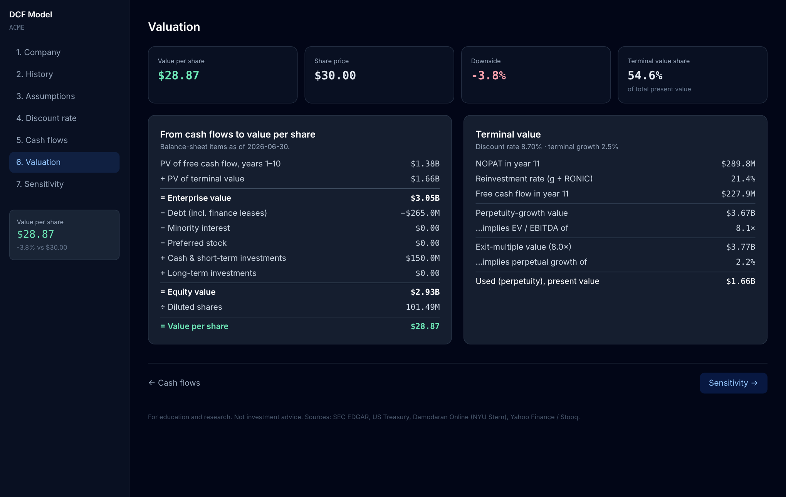
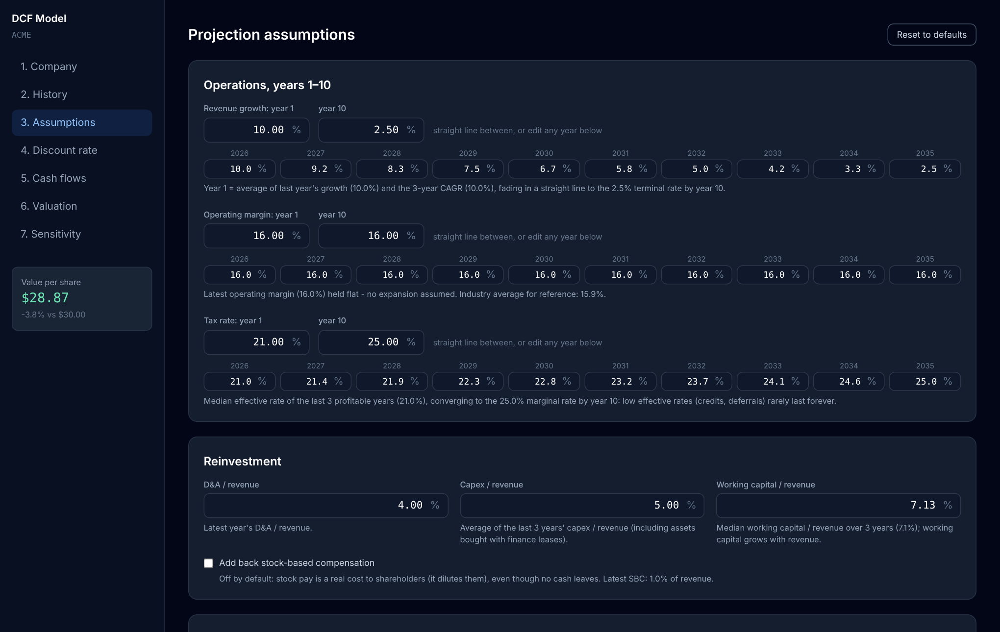

# DCF Valuation Model

**A web app that values any US-listed company with a discounted cash flow model built from its SEC filings, a bottom-up cost of capital, and assumptions that explain themselves.**

Type a ticker. The app pulls up to six years of 10-K data from SEC EDGAR, the latest balance sheet from the most recent 10-Q, today's 10-year Treasury yield, the company's industry beta and credit spread, and the share price. It then builds a 10-year forecast. Every default comes with a one-line reason, and you can change any number.

**Try it:** [dcf-valuation-ecru.vercel.app](https://dcf-valuation-ecru.vercel.app) — no account needed. Type a ticker such as MSFT or KO.





<sub>Screenshots use the built-in demo company (`--demo`), not a real stock.</sub>

## Quick start

```bash
git clone https://github.com/arlomaury/DCF-Valuation.git
cd DCF-Valuation
python3 dcf_model.py --email you@example.com   # first run only; SEC requires a contact email
python3 dcf_model.py                           # opens http://127.0.0.1:8787
```

You need Python 3.9+, with no required packages. Optional extras: `pip install -r requirements.txt` adds `certifi`, which fixes HTTPS certificate errors on python.org builds for macOS, and `pip install yfinance` adds a more reliable share-price source.

To try it without internet access or an email, run `python3 dcf_model.py --demo`.

## Hosting it online

`app.py` serves the same page and two read-only endpoints (`/api/search`, `/api/company`) as a standard WSGI app, which is what Vercel's Python runtime expects. To deploy, import the repository in Vercel and add one environment variable, `DCF_SEC_CONTACT`, set to the contact email SEC requires. There's nothing to build and no accounts or API keys: the endpoints only read public data and keep no user state. SEC downloads are cached on the server, so repeat lookups don't reach SEC again. To try the hosted build locally, run `python3 app.py`.

## How the valuation works

| Step | Method | Default and why |
|---|---|---|
| **Revenue** | 10-year projection | Year 1 is the average of last year's growth and the 3-year CAGR, capped at −10% to +40%. When the two are more than 10 points apart (a one-off such as Pfizer's COVID peak), last year's growth is used on its own. It fades in a straight line to the terminal growth rate by year 10. |
| **Operating margin** | EBIT ÷ revenue | The latest margin is held flat, with no expansion assumed. One-time write-downs (goodwill and asset impairments) are excluded first, the way analysts normalize a base year. If the latest year is under half the 3-year average, the average is used. A negative margin converges to the industry average. |
| **Taxes** | Effective → marginal, with loss carryforwards | Starts at the median effective rate of the profitable years among the last 3 (the marginal rate if none were profitable) and converges to the 25% US marginal rate. A projected loss is carried forward and shelters later profits, up to 80% of each year's taxable income (the federal rule since 2018). A loss-making company also starts with the carryforward its 10-K reports (the federal tax asset grossed up at 21%, or the total at 25%). Losses still unused after year 10 are valued separately and added to enterprise value. |
| **Reinvestment** | Capex, D&A, working capital as % of revenue | Uses the latest year's D&A and a 3-year average for capex. Capex then fades in a straight line to the steady state the terminal value assumes (D&A plus the reinvestment g ÷ RONIC requires), so year 10 and the terminal value describe the same business. A toggle holds it flat instead. Capex includes assets acquired through finance leases. Working capital is held at its 3-year median share of revenue. |
| **Free cash flow** | FCFF = EBIT(1 − t) + D&A − capex − ΔNWC | Stock-based compensation is treated as a real cost and is not added back. A toggle is available. |
| **Terminal value** | Perpetuity growth with value-driver reinvestment: FCF₁₁ = NOPAT₁₁ × (1 − g ÷ RONIC) | g equals the 10-year Treasury yield (Damodaran's default, and the growth rate behind the implied equity risk premium the model uses). The terminal beta is held between 0.8 and 1.2, because a company growing with the economy carries about market risk. RONIC sits halfway between the company's ROIC and the terminal cost of capital. Terminal EBIT adds back amortization above capital spending (an EBITA basis), since acquired intangibles amortize away. An exit multiple is shown as a cross-check. |
| **Terminal discount rate** | Stable-period beta | For the terminal value only, the levered beta is held between 0.8 and 1.2 (Damodaran's stable-growth range): a company growing with the economy forever carries close to market risk. |
| **Discounting** | Mid-year convention, valued as of the latest balance sheet | The valuation date is the latest 10-Q, not the last fiscal year-end. The part of year 1 already gone (the stub period) is in that balance sheet's cash, so only the rest of year 1 is counted and every cash flow is that much closer. Each year is discounted from its midpoint; the perpetuity from n − 0.5 and an exit-multiple sale from the end of year n, both less the stub. |
| **Cost of equity** | Rf + βL × ERP | Rf is the live 10-year Treasury yield. ERP is Damodaran's implied ERP for the S&P 500 (January), brought up to date the way he updates it monthly: re-solved at today's S&P 500 level and Treasury yield. The beta is the industry's unlevered beta, corrected for cash, then re-levered at the company's market D/E: βL = βu(1 + (1 − t)D/E). |
| **Cost of debt** | Rf + default spread | The spread comes from a synthetic rating based on interest coverage (EBIT ÷ interest), using Damodaran's tables. Large and small firms use separate tables. |
| **WACC** | Market-value weights | Equity is price × diluted shares. Debt is current + long-term + finance leases. A target capital structure can be entered instead. |
| **Equity bridge** | EV − debt − minority interest − preferred − unfunded pension + cash, investments and stakes | Balance-sheet items come from the latest 10-Q. An unfunded pension is subtracted after tax, as debt owed to retirees. Stakes in unconsolidated companies (equity-method investments, e.g. Coca-Cola's bottlers) are added at book value, because their profits sit below operating income; they are skipped only when the latest year's EBIT had to be derived from a pre-tax income figure that already includes that income. |
| **Per share** | ÷ diluted shares | Starts from cover-page shares outstanding, summed across share classes, × (diluted ÷ basic weighted shares). |

A free-cash-flow-to-equity mode is also available. It discounts cash flow after interest and net borrowing at the cost of equity, and assumes debt grows with revenue.

The valuation page flags problems as they come up: a terminal value above 85% of the total, growth above the risk-free rate, RONIC below the terminal-period WACC, a negative terminal cash flow, and a missing price or share count. Banks and insurers get a warning that a free-cash-flow DCF doesn't fit them.

### Data handling details that matter

- **52/53-week fiscal years** are labelled from the period end date minus 7 days. A year ending 2025-01-04 counts as fiscal 2024, so two years can't collide and drop one.
- **Tag changes are merged year by year.** For example, a company that switched from `SalesRevenueNet` to `RevenueFromContractWithCustomer…` in 2018 keeps its full history.
- **Restated values win.** Each year uses its most recently filed number.
- **Year-end balances can come from a later 10-Q.** When a 10-K leaves an item untagged, the comparative column of the next 10-Q fills it (NVIDIA's fiscal-2026 securities). A 10-K figure always wins. An item the latest 10-K no longer lists, or that the latest 10-Q shows only in its year-end column, is treated as zero rather than carried over.
- **Debt is built from its parts.** Current debt + long-term debt + finance leases, without double-counting the current portion that `LongTermDebt` already includes. When the balance sheet has no current-portion tag, the debt-maturity table's "due within 12 months" is used (Caterpillar).
- **D&A also searches company-specific XBRL namespaces**, which some large filers use for their cash-flow D&A line.

## Why many stocks show a large downside

With the 10-year Treasury above 5%, a standard DCF says much of the large-cap market is expensive, and the gap is real rather than an arithmetic slip. Apple at about $333 has a free-cash-flow yield of about 2%. Justifying that price needs roughly 20% revenue growth every year for ten years, or a discount rate below the Treasury yield. The Valuation page shows this directly in a **What today's price implies** panel: the growth rate and the discount rate at which the model would agree with the market. Use it to judge whether the market or the forecast is the optimistic one.

## Checks a reviewer would run

The Valuation page warns when a result fails the checks professional reviewers apply: a discount rate below the Treasury yield or above about 14%; terminal value above 85% of the total; RONIC more than 5 points above the cost of capital forever; and a perpetuity value that implies an EV/EBITDA multiple outside about 4-30×.

## Data sources

| Data | Source | Freshness |
|---|---|---|
| Financial statements | [SEC EDGAR XBRL company facts](https://www.sec.gov/edgar/sec-api-documentation) | Live, cached 6 hours |
| Industry (SIC code) | SEC EDGAR submissions | Live, cached 7 days |
| Risk-free rate | [US Treasury daily par yield curve](https://home.treasury.gov/resource-center/data-chart-center/interest-rates), FRED as fallback | Live, cached 6 hours |
| Industry betas, margins, rating spreads, ERP | [Damodaran Online, NYU Stern](https://pages.stern.nyu.edu/~adamodar/) | January 2026 data set, in `market_data.py`. The ERP is updated live from the S&P 500 level (Cboe). |
| Share price | yfinance (if installed) → Cboe delayed quotes → Yahoo Finance → Stooq | Up to 15 minutes delayed. Can also be entered by hand. |

## Security and privacy

- Runs only on your computer. The server listens on `127.0.0.1` and refuses requests from other websites (Host and Origin checks, plus a strict Content-Security-Policy).
- No third-party scripts and no CDNs. React is bundled in `web/vendor/`, so the page loads nothing from outside your machine.
- All downloads use verified HTTPS.
- Your SEC contact email is stored in `~/.dcf_model_cache/config.json` (readable only by you) and sent only to sec.gov, as SEC's [fair-access policy](https://www.sec.gov/os/accessing-edgar-data) requires.
- No API keys and no accounts.

## Tests

```bash
python3 -m pytest tests/        # SEC parsing, debt, shares, ratings, industry mapping
node --test tests/*.test.js     # valuation math (hand-computed) + randomised stress test
```

## Project layout

```
dcf_model.py        local web server, SEC / Treasury / price downloads
sec_data.py         XBRL parsing: annual series, latest balance sheet, debt, shares
market_data.py      Damodaran tables, SIC → industry map, synthetic ratings
demo_data.py        synthetic company used by --demo and the tests
web/engine.js       all valuation math (pure functions, unit-tested)
web/src/app.jsx     UI source → compiled to web/app.js by scripts/build_web.sh
web/vendor/         React 18.3.1 (bundled, no CDN)
tests/              pytest + node:test suites
```

Only run `scripts/build_web.sh` (needs Node 18+) after editing the UI. The compiled files are committed.

## Limitations

- US GAAP 10-K filers only. Foreign companies that file 20-F (IFRS) aren't supported.
- Not suited to banks, insurers, or other financial firms.
- Share classes with different economics, such as Berkshire's A and B, may need the share count entered by hand. The app falls back to weighted-average shares when the cover-page count looks inconsistent.
- The pension deficit is read from the single total funded-status tag. Many companies (Procter & Gamble, Caterpillar, Coca-Cola) only report it split by plan, so it shows as zero for them. Check the pension note in the 10-K for those.
- Operating leases stay in operating costs, which is consistent with US GAAP EBIT. They aren't capitalized as debt.
- Damodaran's tables are updated each January. Update `market_data.py` to refresh them.

## License

MIT. See [LICENSE](LICENSE).

*For education and research. Not investment advice.*
